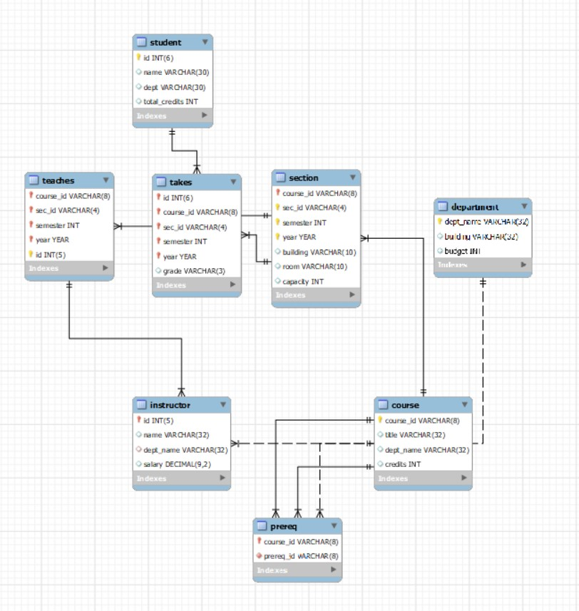

# Design Document

## Database Architecture



## Software

---

This application is uses the following python modules:

* `Django 3.2.8`
* `mysql-connector-python 8.0.28`

and mySQL version 8.0.28.


## Accounts 

---

Accounts are handled through the built-in django account manager accessible at `http://[hostname]/admin`. The users for the application are already created, and consist of `admin`, `instructor`, and `student`. Each has a unique login, with the credentials listed below.

Student

`username` student

`password` j9p8XVLCDwqs7ch

Instructor

`username` instructor

`password` BaAa5RLbbAb2zHY

Admininstator

`username` admin

`password` VEcPmp7SQcbd5Ez

Logging in will redirect the user to a page with a list of actions for which the user has authorization to complete. The admin has access to all actions, including the instructor and student actions. Instructor has access to both instructor and student actions.

Each function contains two decorators: `@login_required()` and `@csrf_exempt()`. The `login_required()` decorator will cause Django to redirect the user back to the login page if they have not logged in. 

Each page was constructed using Django templates, less the results page, so that they could be decorated with `@csrf_exempt()` to prevent the need for csrf tokens. 

The main page that lists all of the actions possible for a given user checks the user's username to display what actions are possible for that authorization group.

```html

  <p><a herf="">Student</a></p>
  <p><a herf="">Log Out</a></p>

  <p><a herf="">Student</a></p>
  <p><a herf="">Professor</a></p>
  <p><a herf="">Log Out</a></p>

  <p><a herf="">Student</a></p>
  <p><a herf="">Professor</a></p>
  <p><a herf="">Admin</a></p>
  <p><a herf="">Log Out</a></p>

```

As you increase in authorization, more actions will be available for the account.

## File Structure 

---

The relevant files in the project structure are as follows (in the root `University` directory):

| Path | Purpose |
|:---- |:------- |
| `univ/` | Holds all views, models and admin info |
| `university/` | Holds project settings and urls |
| `univ/admin.py` | Model registration for django admin panel |
| `univ/apps.py` | Basic name configuration |
| `univ/models.py` | Model definitions generated from mysql database |
| `university/settings.py` | Main django config file |
| `university/urls.py` | URL path definitions |
| `university/views.py` | Holds front-facing and redirect pages |
| `static/` | Static directory |
| `static/css/` | CSS files |
| `static/js` | JS files |
| `templates/` | Templates used by views*.py files |
| `templates/registration/` | Templates related to the login |
| `templates/admin.html` | Templates related to the login |
| `templates/professor.html` | Template for professor page |
| `templates/student.html` | Template for student page |
| `templates/homepage.html` | Template for action menu |

### Action Menu 

---

This is the main page of the application. After a user logs in, they will be directed here. All of the actions the user is permitted to use will be displayed, organized by access level. This is controlled internally through the template pages that will display the functions available to the user.

### F1 

---

Returns a list of professors sorted by one of the following criteria: name, dept, or salary.

Permission group: admin

Location: `univ/views/f1`

| Parameters | Values |
|:----------:|:-------:|
| `order` | `name` or `dept_name` or `salary`|


### F2 

---

Returns a table of min/max/average salaries by dept.

Permission group: admin

Location: `univ/views/f2`

| Parameters | Values |
|:----------:|:-------:|
| `department` | `dept_name` or None |

### F3 

---

Returns a table of professor name, dept, and total number of students taught by the professor in a given semester

Permission group: admin

Location: `univ/views/f3`

| Parameters |                    Values                     |
|:----------:|:---------------------------------------------:|
| None | `instructor_name` and `dept_name` and `numStudents` |


### F4 

---

Returns the list of course sections and the number of students enrolled in each section that the professor taught in a given semester

Permission group: Professors

Location: `univ/views/professorCourses`

|      Parameters       |                        Values                         |
|:---------------------:|:-----------------------------------------------------:|
|   `courseID` and `sec`    | `courseID`, `sec`, and `numOfstudents` |

### F5 

---

Returns the list of students enrolled in a course section taught by the professor in a given semester

Permission group: Professors

Location: `univ/views/professorStudents`

| Parameters |    Values    |
|:----------:|:------------:|
| `instructor_name`, `semester` and `year` | `courseID`, `secID`, `name`, `semester`, `year`, `instructorID` & `instructor_name` |

### F6 

---

Returns the list of course sections offered by department in a given semester and year.

Permission group: Students

Location: `univ/views/f6`

|         Parameters          |              Values              |
|:---------------------------:|:--------------------------------:|
| `department`, `sem` and `year` | `courseID`, `course`, `dept_name`, `sec`, `sem` and `year` |